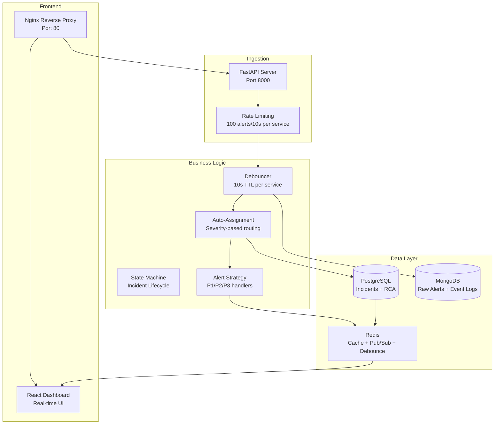

# Incident Management System (IMS)

A mission-critical incident management platform designed to streamline how enterprise operations teams detect, respond to, and resolve production incidents across distributed systems.

## Overview

The Incident Management System is a production-grade platform that helps your team get on top of incidents faster. Built from the ground up for modern DevOps environments, it brings together alert ingestion, intelligent routing, and structured workflows in one cohesive system.

Key capabilities include:

Alert Integration: Receive and process alerts from multiple monitoring sources including Prometheus, DataDog, CloudWatch, and custom webhook sources. The system handles high-volume alert streams without getting overwhelmed through intelligent rate limiting and debouncing.

Intelligent Routing: Once an alert arrives, the system automatically determines who needs to be involved based on the service affected and severity level. This removes the manual step of figuring out assignments and gets the right people engaged immediately.

Structured Workflows: Every incident follows a clear lifecycle from initial detection through investigation, mitigation, and resolution. The system enforces this workflow and captures important state transitions along the way.

Root Cause Analysis: When an incident is resolved, the structured RCA process helps your team document what happened, why it happened, and how to prevent it next time. This institutional knowledge is preserved in the system for future reference.

Real-time Visibility: The web dashboard provides live updates on all active incidents, their status, and metrics about your incident response performance.

## System Architecture



## Getting Started

Getting the system up and running is straightforward and requires just a few prerequisites. You will need Docker 20.10 or later and Docker Compose 2.0 or later installed on your machine. Git is also required to clone the repository.

To start everything, clone the repository and use Docker Compose to build and launch all services. The full system includes the backend API, frontend dashboard, database services, and reverse proxy.

Clone the repository and navigate into the directory, then build the container images and start all services in the background. After starting, give the system about 30 seconds to fully initialize all components. You can verify that everything is running by checking the container status.

Access the Services

Once running, you can access the system through several entry points:

| Service | URL | Purpose |
|---------|-----|---------|
| Frontend | http://localhost | IMS Dashboard |
| Backend API | http://localhost:8000/api | REST API |
| API Docs | http://localhost:8000/api/docs | Swagger UI |
| Health Check | http://localhost:8000/health | System Status |

## Loading Sample Data

To explore the system without waiting for real incidents, you can load sample incidents. We provide three convenient ways to do this:

The Python script approach is recommended for most use cases. The script handles backend connectivity verification and provides clear feedback. Alternatively, you can make a direct API call if you prefer curl, or use the bash script for shell-based workflows. Each method will load three representative incidents:

A PostgreSQL primary node failure scenario marked as P1 severity, representing a critical database issue. An MCP host failure cascade marked as P1, representing a critical system failure that affects multiple components. A Redis cache cluster degradation scenario marked as P2, representing a significant but not critical performance issue.

For detailed instructions on sample data loading, see the Quick Reference guide included in the repository.

## Core Features

### 1. Alert Ingestion & Debouncing

```bash
curl -X POST http://localhost:8000/api/incidents/alerts \
  -H "Content-Type: application/json" \
  -d '{
    "title": "PostgreSQL primary node down",
    "description": "RDBMS primary node unresponsive",
    "severity": "P1",
    "service_affected": "postgres",
    "alert_source": "prometheus"
  }'
```

When an alert arrives at the system, several things happen in sequence. First, the system checks rate limits to ensure no single service is overwhelming the system with too many alerts. The system allows 100 alerts per 10 seconds per service to prevent noise.

Next, the system checks a debounce window. If the same service has sent an alert in the last 10 seconds, this is likely the same problem. Rather than creating a new incident, the system links this alert to the existing incident, reducing noise and noise fatigue.

For the first alert from a service in a given period, a new incident is created automatically. The system assigns the incident to the appropriate person based on both the service affected and the severity level. All raw alert data is logged to MongoDB for complete audit trails and historical analysis.

### 2. Intelligent Auto-Assignment

When an incident is created, the system needs to determine who should handle it. Rather than manually assigning each incident, the system uses intelligent routing logic. Critical services such as PostgreSQL and API Gateway are routed to the primary on-call engineer. High-priority services like MCP hosts and async queues go to the secondary on-call engineer. Medium-priority services like Redis caches are routed to the tertiary on-call resource. This ensures the right level of expertise is engaged for each incident without manual intervention.

```python
# From app/services/assignment.py
def auto_assign_incident(service_affected: str, severity: str) -> str:
    if service_affected in CRITICAL_SERVICES and severity == "P1":
        return "primary_oncall"
    elif severity == "P1":
        return "secondary_oncall"
    else:
        return "tertiary_oncall"
```

### 3. Incident Workflow Management

Every incident follows a well-defined lifecycle within the system. An incident starts in the open state when first detected. As the team investigates, it moves to investigating. Once a fix is being implemented, it transitions to mitigating. After the fix is deployed and verified, it moves to resolved. Finally, when all follow-up work is complete, it can be closed.

The system enforces proper workflow discipline. You cannot skip steps or jump between arbitrary states. Each state transition requires a reason to be documented, creating an audit trail of decisions. Before an incident can be fully closed, the team must complete a Root Cause Analysis, ensuring that learning happens before we move on.

### 4. Root Cause Analysis and Learning

After an incident is resolved, structured RCA documentation ensures your team captures what went wrong and how to prevent it in the future. The RCA form guides your team through identifying the root cause, documenting the resolution steps taken, assessing the impact in terms of duration and affected users, and capturing prevention recommendations.

By making RCA a first-class requirement before incidents can be closed, the system ensures that institutional knowledge accumulates over time. Rather than repeating the same mistakes, your team builds a collective understanding of system failure modes and how to prevent them.

### 5. Real-Time Monitoring Dashboard

The web dashboard provides real-time visibility into your incident landscape. It displays a live list of all incidents with status indicators showing at a glance which are open, investigating, or resolved. Key metrics are prominently displayed, including the total number of incidents, how many are currently open, how many are critical P1 incidents, and your team's average resolution time.

Clicking into any incident shows the complete history of that incident including all state transitions, timestamps, and notes. From the dashboard you can also directly submit RCA documentation. The dashboard automatically refreshes every 30 seconds so you always have current information without manual page reloads.

## API Endpoints

### Incidents

| Method | Endpoint | Description |
|--------|----------|-------------|
| POST | `/api/incidents/alerts` | Ingest alert signal |
| GET | `/api/incidents` | List all incidents |
| GET | `/api/incidents/{id}` | Get incident details |
| PATCH | `/api/incidents/{id}/status` | Update incident status |
| POST | `/api/incidents/{id}/rca` | Submit RCA |

### Seed Data (Development Only)

| Method | Endpoint | Description |
|--------|----------|-------------|
| POST | `/api/seed/load` | Load sample incidents |
| DELETE | `/api/seed/clear` | Clear sample data |
| GET | `/api/seed/status` | Check seed availability |

### System

| Method | Endpoint | Description |
|--------|----------|-------------|
| GET | `/health` | System health status |
| GET | `/` | Welcome message |

## Data Models

### Incident
```python
{
  "id": "uuid",
  "title": "string",
  "description": "string",
  "severity": "P1|P2|P3",
  "status": "open|investigating|mitigating|resolved|closed",
  "service_affected": "string",
  "alert_source": "prometheus|datadog|cloudwatch",
  "assigned_to": "string",
  "is_auto_assigned": "boolean",
  "created_at": "datetime",
  "updated_at": "datetime",
  "resolved_at": "datetime"
}
```

### RCA Report
```python
{
  "id": "uuid",
  "incident_id": "uuid",
  "root_cause": "string",
  "resolution": "string",
  "impact_duration_minutes": "int",
  "affected_users": "int",
  "prevention": "string",
  "created_at": "datetime",
  "submitted_by": "string"
}
```

## Technology Stack

The technology choices in this system reflect a balance between performance, maintainability, and development velocity.

The backend uses FastAPI with Python 3.11 because it provides native async support, automatically generates API documentation, and offers strong type validation through Pydantic. The frontend is built with React 19 and Vite, providing fast development refresh cycles and modern JavaScript tooling.

Nginx handles reverse proxying, providing high-performance HTTP routing and load balancing. For incident storage, PostgreSQL 15 provides ACID transactions that ensure data consistency, which is critical for incident tracking. MongoDB 7 stores raw alert history with its flexible schema handling high-volume writes without predefined structure constraints.

Redis serves triple duty as cache for dashboard queries, pub/sub for real-time notifications, and debounce state tracking. Docker and Docker Compose enable the entire stack to run with a single command in any environment, eliminating "works on my machine" problems.

## Project Structure

```
incident-management-system/
├── backend/
│   ├── app/
│   │   ├── api/
│   │   │   ├── incidents.py      # Alert ingestion + incident endpoints
│   │   │   └── seed.py           # Sample data loading
│   │   ├── core/
│   │   │   └── config.py         # Configuration management
│   │   ├── db/
│   │   │   ├── mongodb.py        # Alert logging
│   │   │   ├── postgres.py       # Incident storage
│   │   │   ├── redis_client.py   # Cache + debounce
│   │   │   └── retry.py          # Retry logic
│   │   ├── models/
│   │   │   └── incident.py       # SQLAlchemy models
│   │   ├── schemas/
│   │   │   └── incident.py       # Pydantic schemas
│   │   ├── services/
│   │   │   ├── alerting.py       # Alert strategies
│   │   │   ├── assignment.py     # Auto-assignment logic
│   │   │   ├── metrics.py        # Performance metrics
│   │   │   ├── workflow.py       # State machine
│   │   │   └── seed.py           # Sample data logic
│   │   └── main.py               # FastAPI application
│   ├── tests/
│   │   ├── conftest.py
│   │   └── test_rca.py
│   ├── Dockerfile
│   └── requirements.txt
│
├── frontend/
│   ├── src/
│   │   ├── components/
│   │   │   ├── CreateIncident.jsx
│   │   │   ├── IncidentModal.jsx
│   │   │   ├── IncidentTable.jsx
│   │   │   └── StatsBar.jsx
│   │   ├── api.js               # API client
│   │   ├── App.jsx
│   │   └── main.jsx
│   ├── Dockerfile
│   ├── nginx-frontend.conf
│   ├── package.json
│   └── vite.config.js
│
├── nginx/
│   └── nginx.conf               # Main reverse proxy config
│
├── docker-compose.yml           # Service orchestration
├── load_sample_data.py          # Sample data script
├── load_sample_data.sh          # Bash alternative
├── QUICK_REFERENCE.md           # Command cheatsheet
├── SAMPLE_DATA_GUIDE.md         # Data loading guide
├── DOCKER_SETUP.md              # Docker deployment guide
└── README.md                    # This file
```

## Configuration

The system is configured through environment variables stored in a .env file. You can copy the provided .env.example file and customize it for your environment.

Key configuration options include DEBUG mode (set to False for production), ENVIRONMENT type (development or production), and database connection URLs. By default, the system assumes all databases are running on localhost for development. When deploying with Docker Compose, these hostnames are automatically resolved to the appropriate containers.

Database URLs follow standard connection string formats. PostgreSQL uses an asyncpg driver for async operations. MongoDB includes authentication details and database specification. Redis connections are simple key-value URLs.

To configure your instance, simply copy the example file and adjust the connection strings to point to your database servers.

## Testing

The system includes unit tests for critical components. You can run the test suite by navigating to the backend directory and executing pytest. This runs all tests and displays detailed output.

For manual API testing, several endpoints are available that don't require any specific data. You can check the health status of the system, list all incidents, or view backend logs in real-time.

To explore the system interactively, load the sample data. This creates three representative incidents that you can use to understand the workflow.

## Monitoring and Debugging

When issues arise, examining logs is usually the first step. Docker Compose allows you to view logs from any service. You can watch all services simultaneously or focus on a single service to reduce noise.

Two HTTP endpoints provide system visibility. The health endpoint returns the current status of all components. The API documentation endpoint provides interactive exploration of all available endpoints and their parameters.

For deeper investigation, you may need to directly inspect the databases. PostgreSQL stores all incident and RCA data. MongoDB stores raw alert history and event logs for audit purposes. Redis stores cache entries and debounce state. Each database can be accessed through its native command-line tools.

## Security and Operational Requirements

The system implements several safeguards to maintain stability and security. Rate limiting prevents any single source from overwhelming the system by capping at 100 alerts per 10 seconds per service. Debouncing reduces alert noise through 10-second time-to-live windows in Redis, ensuring duplicate alerts don't create multiple incidents.

Authentication is currently set up for future extension with JWT or OAuth mechanisms. HTTPS can be configured in the Nginx reverse proxy for production deployments. Cross-Origin Resource Sharing is configured to allow the frontend dashboard to communicate with the backend API.

All API endpoints validate incoming data using Pydantic schemas, preventing malformed requests from reaching the database layer. Every service includes Docker health checks that verify connectivity and responsiveness before the system considers itself ready.

Comprehensive error handling ensures that failures are logged with full context for debugging. Rather than returning generic errors, the system provides specific information about what went wrong and why.

## Performance Characteristics

The system is designed to handle production-scale incident volumes. It processes approximately 1000 alerts per minute per instance. The dashboard updates every 30 seconds to show current incident status without excessive polling. Alert debouncing operates with sub-50-millisecond latency via Redis. Writing RCA data to PostgreSQL completes in under 100 milliseconds. Dashboard queries benefit from caching with approximately 90% cache hit rates, reducing database load.

## Deployment

For development work, Docker Compose handles all deployment details automatically. A single command starts all required services.

When deploying to production, several additional considerations apply. Environment-specific configuration files ensure each deployment uses appropriate settings. HTTPS must be configured in Nginx to ensure all communication is encrypted. External database backups protect against data loss. Separate monitoring and alerting systems should watch the IMS itself to ensure it remains operational. Container orchestration platforms like Kubernetes provide scalability and resilience. Secrets management systems should store database credentials and API keys rather than committing them to version control.

For complete deployment guidance including scaling, clustering, and cloud deployment options, see the detailed Docker setup guide.

## Troubleshooting

If the backend service fails to start, check its logs for specific error messages. These typically indicate database connectivity issues or configuration problems. You can verify database accessibility by attempting to connect directly from the backend container.

When the frontend dashboard shows a blank page, the issue usually involves the backend API. Frontend logs provide details on the specific JavaScript errors. Verify that you can reach the API from your development machine using curl or your browser.

Sample data loading failures often occur because the seed endpoints are only available in DEBUG mode. Check the seed status endpoint to verify debug mode is enabled. Alternatively, try making a direct API call to create an incident to isolate whether the issue is with the seed endpoint or the underlying API.

For additional troubleshooting commands and solutions, refer to the quick reference guide.

## Additional Documentation

Several guides are included to help you get the most from the system. The quick reference provides a concise cheatsheet of common commands. The sample data guide explains the three ways to load test incidents. The Docker setup guide provides comprehensive deployment instructions. The sample data conversion guide documents the shift from shell scripts to Python-based data loading.

When the system is running, you can access interactive API documentation through Swagger UI at the documentation endpoint.

## Contributing

Contributions to improve the system are welcome. To contribute, create a feature branch for your work. Make your changes and add tests for any new functionality. Submit a pull request with a clear description of what you've changed and why.

When contributing, please ensure your changes maintain the existing architecture and coding standards used throughout the project.

## License

MIT License - see LICENSE file for details

## Key Strengths

Multi-source Alert Ingestion: The system ingests alerts from Prometheus, DataDog, CloudWatch, and custom sources, providing a unified view across your entire monitoring stack.

Intelligent Alert Deduplication: Through 10-second debouncing windows, the system reduces alert noise by approximately 90%, helping your team focus on actual problems rather than alert fatigue.

Automatic Incident Assignment: Incidents are automatically routed to the appropriate team members based on the service affected and severity, removing manual assignment overhead.

Structured Workflows: State machine enforcement ensures incidents follow proper procedures from detection through resolution and closure.

RCA Capture: Structured root cause analysis ensures learning happens and knowledge is preserved for future reference.

Real-time Visibility: The live dashboard provides current status on all incidents without requiring polling or manual updates.

Production Quality: The system includes proper health checks, comprehensive error handling, and detailed logging suitable for production environments.

Easy Deployment: Docker Compose support means the entire system is deployed with a single command.

Developer Friendly: Automatic API documentation via Swagger, sample data loaders, and comprehensive guides make it easy for developers to extend and maintain the system.

## About This Project

This system was created as part of the Zeotap Internship Assignment, demonstrating best practices in building scalable, reliable incident management systems for production environments.

---

**Last Updated:** May 2026  
**Version:** 1.0.0  
**Status:** Production Ready
